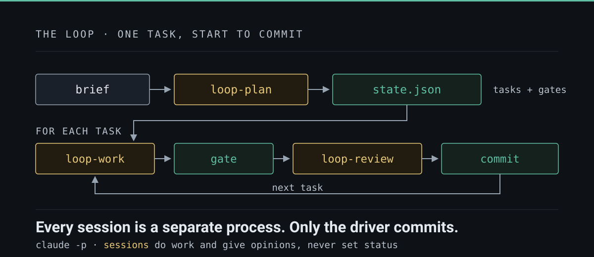

<style>
section.loop {
  background: #0E1116;
  color: #E6EAF0;
  font-size: 26px;
  padding: 60px 70px;
}
section.loop h1, section.loop h2 { color: #5FBFA3; }
section.loop h1 { font-size: 1.9em; }
section.loop h2 { font-size: 1.25em; margin-bottom: .4em; }
section.loop strong { color: #5FBFA3; }
section.loop code {
  background: #171C23;
  color: #C9D4E0;
  font-size: .85em;
}
section.loop pre {
  background: #171C23;
  border: 1px solid #2A313B;
  border-radius: 8px;
  font-size: .62em;
  line-height: 1.45;
}
section.loop pre code { background: none; }
section.loop .hljs-string { color: #9FD8C2; }
section.loop .hljs-attr, section.loop .hljs-keyword, section.loop .hljs-built_in { color: #86B8EA; }
section.loop .hljs-comment { color: #7E8C9C; }
section.loop .hljs-number, section.loop .hljs-literal { color: #E0A75E; }
section.json pre { font-size: .56em; }
section.json pre code { white-space: pre-wrap; word-break: break-word; }
section.loop table { font-size: .74em; border-collapse: collapse; }
section.loop table,
section.loop thead,
section.loop tbody,
section.loop tr,
section.loop tr:nth-child(even),
section.loop tr:nth-child(odd),
section.loop td,
section.loop th { background: transparent !important; color: #E6EAF0; }
section.loop tr:nth-child(even) td { background: #12171E !important; }
section.loop th { color: #5FBFA3; text-align: left; }
section.loop td, section.loop th {
  border: 1px solid #2A313B;
  padding: .45em .7em;
  vertical-align: top;
}
section.loop blockquote {
  border-left: 4px solid #5FBFA3;
  padding-left: .8em;
  color: #9FB0C3;
}
section.loop a { color: #5FBFA3; }
section.loop footer, section.loop::after { color: #6B7A8C; }
section.lead { justify-content: center; text-align: center; }
section.lead h1 { font-size: 2.3em; }
section.tweet { justify-content: center; }
section.tweet h2 { font-size: 1.9em; line-height: 1.25; }
section.minimal { justify-content: center; }
section.minimal h1 { font-size: 2.5em; line-height: 1.2; margin: .1em 0 .5em; }
section.minimal h2 {
  font-size: .8em;
  color: #6B7A8C;
  letter-spacing: .12em;
  text-transform: uppercase;
  margin-bottom: .2em;
}
section.minimal ul { list-style: none; padding: 0; margin: 0; }
section.minimal li { font-size: 1.15em; color: #9FB0C3; margin: .3em 0; }
section.minimal li strong { color: #E6EAF0; }
section.minimal code { font-size: .95em; }
section.loop .cols { display: flex; gap: 20px; align-items: flex-start; }
section.loop .cols > pre { flex: 1; min-width: 0; margin: 0; }
section.loop .cols + p { margin-top: .7em; }
section.loop img[alt="loop"] { background: none; }
</style>

<!-- _class: loop lead -->
<!-- _paginate: false -->

# An autonomous loop

### A mechanical loop,<br/>three sessions, one state file, and a gate.<br/>No subagents!

<br/>

Miguel Veloso · miguelveloso.dev

<!--
Speaker notes: the loop is the deliverable; the program it builds is just the
proof it ran.
-->

---

## The shape of one run



<!--
A brief becomes state.json with a gate per task. Then for every task: loop-work,
the gate, loop-review — committed only if both passed. The three sessions never
see each other.
-->

---

## The driver — the only thing that commits

```bash
claude -p "/loop-plan <brief>"          # once → .loop/state/state.json

while task = next_ready_task(state):    # first pending whose deps are done
    check budgets                       # max iterations · cost ceiling · convergence
    snapshot state.json

    claude -p "/loop-work $task"        # fresh session → tmp/proposal.json
    restore state.json if touched       # the plan is not a session's to edit
    restore any gate file it moved

    for t in done_tasks + [task]:       # THE GATE — every done task, every iteration
        run t.verify                    # a task that stops verifying → pending, attempt burned

    if gate_passed and proposal.outcome == "done":
        claude -p "/loop-review $task"  # fresh session → tmp/verdict.json

    apply: done │ pending (+1 attempt) │ blocked (attempts >= 3)
    append journal + telemetry
    git commit -m "[loop] $task: $outcome"     # exactly one commit per iteration
```

<!--
Bash, ~1000 lines, no framework. Every status transition belongs here. Note the
gate runs for *every* done task, not just the current one — that is the
regression check.
-->

---

## Three skills, three jobs, no overlap

| | `loop-plan` | `loop-work` | `loop-review` |
| --- | --- | --- | --- |
| **Runs** | once per run | once per iteration | once per iteration |
| **Gets** | the brief | one task id | the same task id |
| **Reads** | brief, `CLAUDE.md`, knowledge roots | its task, journal, references, the files | the task, **the diff**, the references |
| **Writes** | `state.json` | code + `proposal.json` | `verdict.json` only |
| **Must not** | write code | pick another task, touch the plan | edit anything but `verdict.json` |
| **The point** | author every `verify` **before** the code exists | do one task and stop | judge what a command **cannot** check |

<!--
loop-review *may* run whatever it likes — but the driver already re-ran the gate
before waking it, so re-running commands is spending the session on the one
question that is already answered. It is there for the test that asserts
nothing and the function that hardcodes the fixture: "read the evidence, not the
summary" is discipline, not a mechanism — proposal.json is still on disk.
-->

---

<!-- _class: loop json -->

## `state.json` — the single source of truth

```json
{
  "run_id": "0004-runstat-review",
  "brief": "docs/briefs/0004-runstat-review.md",
  "iteration": 6,
  "tasks": [
    {
      "id": "T2",
      "title": "Load reports/NNN-verdict.json in the existing loader",
      "goal": "The verdicts are on disk and nothing can read them...",
      "files": ["src/runstat/loader.py"],
      "depends_on": ["T1"],
      "acceptance": [
        "load_run returns a Run whose verdicts hold one entry per reports/NNN-verdict.json",
        "A verdict file missing any required key raises RunError naming the file"
      ],
      "verify": "uv run python -c \"from runstat.loader import load_run;
                  r=load_run('tests/data/run1');
                  assert [v.task for v in r.verdicts]==['T1','T2','T2']\"
                 && uv run pytest -q",
      "status": "done", "attempts": 0, "notes": ""
    }
  ]
}
```

<!--
Real verify commands are longer — they assert on the parse, never on the text of
the output. `notes` is how a failed attempt talks to the next session: the only
channel between two sessions that never meet.
-->

---

## Every run writes its own evidence

```text
.loop/state/runs/<branch>/<run-id>/
├── sessions/
│       001-work.json        one JSON per session: cost, turns, duration,
│       002-review.json      permission denials, error flag
├── iterations.jsonl         one line per iteration:
│                            {iteration, task, outcome, attempts, tasks_done}
├── reports/
│       001-proposal.json    what the work session claimed
│       001-verdict.json     what the reviewer ruled, criterion by criterion
├── gates/
│       T3.log               every verify command's output
│       007-T3.fail.log      …and a pinned copy of each failure
└── loop.log                 the driver's own narration
```

**Grouped by branch, committed with the iteration, `$HOME` and username masked out.**

<!--
Nothing here is opt-in telemetry: the driver writes it as it goes, in the same
commit as the code. Failures get a pinned per-iteration copy because the plain
gate log is overwritten by the next passing run of the same task.
-->

---

## Two ways to read it

<div class="cols">

```text
$ .loop/run.sh          # at the end of every run

  ── signals ──
  iterations:            11
  tasks closed:          11/11
  iterations per closed: 1.00
  gate failures:         0
  review rejections:     0
  attempts burned:       0
  no-progress streak:    0
  estimated spend:       $9.72
```

```text
$ uv run runstat summary <run>

phase    sessions     cost  turns   wall
work           11  $  5.77    148   681s
review         11  $  3.95    138   509s
total          22  $  9.72    286  1191s

$ uv run runstat review <run>

reviews: 11   passed: 11   failed: 0
criteria ruled: 68   not met: 0
evidence cited: 68/68
coherence: ok
```

</div>

**The driver prints the signals live and stops on them. `runstat` recomputes the same numbers from the files — and the two agreeing is itself a gate.**

<!--
runstat is the program the loop was pointed at first: summary, signals, compare,
review. The loop built the tool that reads the loop. `compare` puts two runs
side by side with a delta — that is how you tell whether a change to a prompt
actually helped.
-->

---

<!-- _class: loop minimal lead -->

## Three ideas

# A loop.<br/>Files.<br/>Hard gates.

<!--
SUCCINCT VARIANT of the ideas list — pick this or the denser slide that follows.
Say the three sentences; do not put them on the slide.
-->

---

<!-- _class: loop lead -->

## Three ideas worth stealing

<br/>

**1. Why a loop** — context is finite; a run you can resume is worth more than a run that is clever.

**2. Why files** — no chat prompt is ever good enough. Files are reusable, durable, versioned, reviewable.

**3. Why hard gates** — a rule is reinterpreted by every session. A command exits 0 or it does not.

---

<!-- _class: loop minimal -->

## 1 · Why a loop

# Fresh context,<br/>every task.

- **Resume** is reading a file
- **Failure** stops at one task

<!--
SUCCINCT VARIANT of idea 1. Tell the rest: a long session degrades as the window
fills; the loop never asks the model to hold the whole project at once.
-->

---

<!-- _class: loop tweet -->

## 1 · Why a loop

## *Context is the budget. Spend it once per task.*

<br/>

- One long session degrades: the window fills, early decisions fade, quality drifts down.
- A loop spends a **fresh window per task** — the model is never asked to hold the whole project in its head.
- Crash, ^C, laptop closed, 3 a.m. — **resume is just reading `state.json` again**.
- Failure is bounded: one task fails, burns an attempt, blocks at three. It cannot take the run with it.

<!--
The loop does not make the model smarter. It makes the *expensive* part — a
fresh, uncontaminated context — cheap enough to spend on every single task.
-->

---

<!-- _class: loop minimal -->

## 2 · Why files

# A prompt you can<br/>review like code.

- **Versioned · linkable · reusable**
- Broken? **Edit the file, re-run**

<!--
SUCCINCT VARIANT of idea 2. Tell the rest: no chat box ever gets the prompt
right; a brief is argued with before a token is spent, and the same references
bind the work session and the reviewer.
-->

---

<!-- _class: loop tweet -->

## 2 · Why files, not a conversation

## *You cannot write a good enough prompt in a chat box.*

<br/>

- A brief is **edited, reread and argued with** before a single token is spent.
- Files **link to context**: briefs, references with a `why`, a knowledge seam the plan points at.
- Context becomes **reusable** — the same references bind the work session and the reviewer.
- Everything is **version controlled**: the plan, the journal, the telemetry, the diff, in one commit per iteration.
- So it is **traceable** (why did it do that?), **team friendly** (review a plan like a PR), and **recoverable** (fix the file, re-run).

<!--
Chat is a medium with no memory and no diff. Every durable decision in this
system is a file in the repo — which is also why nothing is ever written to
~/.claude.
-->

---

<!-- _class: loop minimal -->

## 3 · Why hard gates

# A rule is read<br/>three different ways.

- `exit 0` **is not**
- Written **before** the code exists

<!--
SUCCINCT VARIANT of idea 3. Tell the rest: gates are authored by a session that
cannot benefit from them, re-run on every iteration, and restored by the driver
if a session edits one — the cheating is helpful, not malicious.
-->

---

<!-- _class: loop tweet -->

## 3 · Why hard gates, not rules

## *A rule is a suggestion with good intentions.*

<br/>

- Prose — *"make sure the tests pass"* — is **reinterpreted by every fresh session**. Three sessions, three readings.
- A `verify` command **exits 0 or it does not**. No judgment, no negotiation, no drift.
- Gates are authored **before the code exists**, by a session that cannot benefit from them — so nobody grades their own homework.
- The driver **restores** a `state.json` or a gate file a session edits: moving the goalpost is a finding, even when the rewrite is an improvement.
- Every done task is re-gated **every iteration** — that is what catches the regression nobody was looking for.

<!--
This is the one that surprises people: the cheating is not malicious, it is
helpful. A session that fixes a failing test by relaxing it is being nice. The
gate is what makes nice unprofitable.
-->

---

<!-- _class: loop lead -->

# Halting cleanly is a success

### Faking progress is the only real failure

<br/>

`miguelveloso.dev/blog/an-autonomous-loop`
