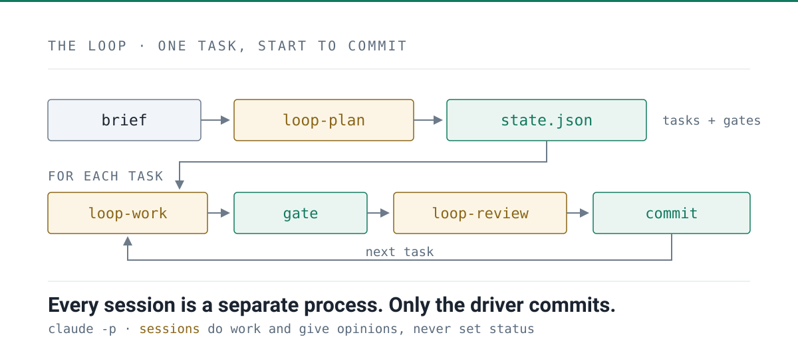

<!-- _class: loop lead -->
<!-- _paginate: false -->

# An autonomous loop

### A shell script,<br/>three sessions, one state file, and a gate.<br/>No subagents!

<br/>

Miguel Veloso · miguelveloso.dev

<div class="qr">


**Open the deck on your phone**

</div>

<!--
Point at the code early — people scan it while you are still on slide one, and
then they can follow along and keep the links afterwards.

Speaker notes: the loop is the deliverable; the program it builds is just the
proof it ran.
-->

---

## The shape of one run




<!--
A brief becomes state.json with a gate per task. Then for every task: loop-work,
the gate, loop-review — committed only if both passed. The three sessions never
see each other.
-->

---

## A shell script: The driver — the only thing that commits

```bash
claude -p "/loop-plan <brief>"          # once → .loop/state/state.json

while task = next_ready_task(state):    # first pending whose deps are done
    check budgets                       # max iterations · cost ceiling · convergence
    snapshot state.json

    claude -p "/loop-work $task"        # fresh session → tmp/proposal.json
    restore state.json if touched       # the plan is not a session's to edit
    restore any gate file it moved

    for t in done_tasks + [task]:       # THE GATE — every done task, every iteration
        run t.verify                    # a task that stops verifying → pending, attempt burned

    if gate_passed and proposal.outcome == "done":
        claude -p "/loop-review $task"  # fresh session → tmp/verdict.json

    apply: done │ pending (+1 attempt) │ blocked (attempts >= 3)
    append journal + telemetry
    git commit -m "[loop] $task: $outcome"     # exactly one commit per iteration
```

<!--
Bash, ~1000 lines, no framework. Every status transition belongs here. Note the
gate runs for *every* done task, not just the current one — that is the
regression check.
-->

---

<!-- _class: loop minimal lead -->

## Three ideas

# A shell loop.<br/>Files.<br/>Hard gates.

<!--
The map for the four slides that follow. Say each idea as a sentence; the slide
only carries the word.
-->

---

<!-- _class: loop minimal -->

## 1 · Why a shell loop

# Fresh context,<br/>every task.

- **Resume** is reading a file
- **Failure** stops at one task

<!--
Tell the rest: a long session degrades as the window
fills; the loop never asks the model to hold the whole project at once.
-->

---

<!-- _class: loop minimal -->

## 2 · Why files

# A prompt you can<br/>review like code.

- **Versioned · linkable · reusable**
- Broken? **Edit the file, re-run**

<!--
Tell the rest: no chat box ever gets the prompt
right; a brief is argued with before a token is spent, and the same references
bind the work session and the reviewer.
-->

---

<!-- _class: loop minimal -->

## 3 · Why hard gates

# A rule is read<br/>three different ways.

- `exit 0` **is not**
- Written **before** the code exists

<!--
Tell the rest: gates are authored by a session that
cannot benefit from them, re-run on every iteration, and restored by the driver
if a session edits one — the cheating is helpful, not malicious.
-->

---

<!-- _class: loop minimal -->

## The model

# The loop is a state<br/>machine over artifacts.

- It never reads **your code**
- It asks: **did the gate pass?**
- It is **tech agnostic**

<!--
Tell the rest: the driver runs a command and reads an exit code and a log. It has
no model of Python, of pytest, of this program at all — that is why the core can
be tech-agnostic. Swap the stack and the gates change; the loop does not.
-->

---

## Three jobs, three skills, no overlap

| | `loop-plan` | `loop-work` | `loop-review` |
| --- | --- | --- | --- |
| **Runs** | once per run | once per iteration | once per iteration |
| **Gets** | the brief | one task id | the same task id |
| **Reads** | brief, `CLAUDE.md`, knowledge roots | its task, journal, references, the files | the task, **the diff**, the references |
| **Writes** | `plan.md` + `state.json` | code + `proposal.json` | `verdict.json` only |
| **Must not** | write code | pick another task, touch the plan | edit anything but `verdict.json` |
| **The point** | author every `verify` **before** the code exists | do one task and stop | judge what a command **cannot** check |

<!--
loop-review *may* run whatever it likes — but the driver already re-ran the gate
before waking it, so re-running commands is spending the session on the one
question that is already answered. It is there for the test that asserts
nothing and the function that hardcodes the fixture: "read the evidence, not the
summary" is discipline, not a mechanism — proposal.json is still on disk.
-->

---

<!-- _class: loop json -->

## `state.json` — the single source of truth

```json
{
  "run_id": "0004-runstat-review",
  "brief": "docs/briefs/0004-runstat-review.md",
  "iteration": 6,
  "tasks": [
    {
      "id": "T2",
      "title": "Load reports/NNN-verdict.json in the existing loader",
      "goal": "The verdicts are on disk and nothing can read them...",
      "files": ["src/runstat/loader.py"],
      "depends_on": ["T1"],
      "acceptance": [
        "load_run returns a Run whose verdicts hold one entry per reports/NNN-verdict.json",
        "A verdict file missing any required key raises RunError naming the file"
      ],
      "verify": "uv run python -c \"from runstat.loader import load_run;
                  r=load_run('tests/data/run1');
                  assert [v.task for v in r.verdicts]==['T1','T2','T2']\"
                 && uv run pytest -q",
      "status": "done", "attempts": 0, "notes": ""
    }
  ]
}
```

<!--
Real verify commands are longer — they assert on the parse, never on the text of
the output. `notes` is how a failed attempt talks to the next session: the only
channel between two sessions that never meet.
-->

---

## Every run writes its own evidence

```text
.loop/state/runs/<branch>/<run-id>/
├── sessions/
│       001-work.json        one JSON per session: cost, turns, duration,
│       002-review.json      permission denials, error flag
├── iterations.jsonl         one line per iteration:
│                            {iteration, task, outcome, attempts, tasks_done}
├── reports/
│       001-proposal.json    what the work session claimed
│       001-verdict.json     what the reviewer ruled, criterion by criterion
├── gates/
│       T3.log               every verify command's output
│       007-T3.fail.log      …and a pinned copy of each failure
└── loop.log                 the driver's own narration
```

**Grouped by branch, committed with the iteration, `$HOME` and username masked out.**

<!--
Nothing here is opt-in telemetry: the driver writes it as it goes, in the same
commit as the code. Failures get a pinned per-iteration copy because the plain
gate log is overwritten by the next passing run of the same task.
-->

---

## Some basic metrics - Two ways to read them

<div class="cols">

```text
$ .loop/run.sh          # at the end of every run

  ── signals ──
  iterations:            11
  tasks closed:          11/11
  iterations per closed: 1.00
  gate failures:         0
  review rejections:     0
  attempts burned:       0
  no-progress streak:    0
  estimated spend:       $9.72
```

```text
$ uv run runstat summary <run>

phase    sessions     cost  turns   wall
work           11  $  5.77    148   681s
review         11  $  3.95    138   509s
total          22  $  9.72    286  1191s

$ uv run runstat review <run>

reviews: 11   passed: 11   failed: 0
criteria ruled: 68   not met: 0
evidence cited: 68/68
coherence: ok
```

</div>

**The driver prints the signals live and stops on them. `runstat` recomputes the same numbers from the files — and the two agreeing is itself a gate.**

<!--
runstat is the program the loop was pointed at first: summary, signals, compare,
review. The loop built the tool that reads the loop. `compare` puts two runs
side by side with a delta — that is how you tell whether a change to a prompt
actually helped.
-->

---

<!-- _class: loop lead -->

# Halting cleanly is a success

### Faking progress is the only real failure

<br/>

`miguelveloso.dev/blog/an-autonomous-loop`

---

<!-- _class: loop refs -->

## References

<div class="cols">

<div>

**This talk**
- The post — [`miguelveloso.dev/blog/an-autonomous-loop/`](https://miguelveloso.dev/blog/an-autonomous-loop/)
- The deck — [`miguelveloso.dev/talks/an-autonomous-loop/`](https://miguelveloso.dev/talks/an-autonomous-loop/)
- The repo — [`github.com/mvelosop/an-autonomous-loop-3`](https://github.com/mvelosop/an-autonomous-loop-3)
- The loop — [`.loop/`](https://github.com/mvelosop/an-autonomous-loop-3/tree/main/.loop) · the briefs — [`docs/briefs/`](https://github.com/mvelosop/an-autonomous-loop-3/tree/main/docs/briefs) · references — [`docs/references/`](https://github.com/mvelosop/an-autonomous-loop-3/tree/main/docs/references)

**The tools**
- Claude Code — [`docs.claude.com/en/docs/claude-code`](https://docs.claude.com/en/docs/claude-code)
- Marp —        [`marp.app`](https://marp.app)
- uv —          [`docs.astral.sh/uv`](https://docs.astral.sh/uv)

</div>

<div class="qr">


**This page**

</div>

</div>

<!--
The QR lands on this slide of the published deck, so nobody has to photograph a
list of URLs.
-->
